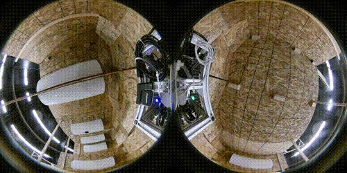
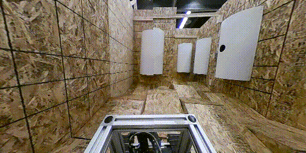
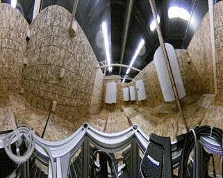
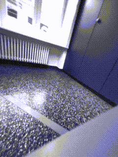
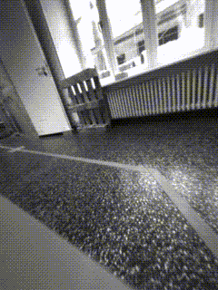
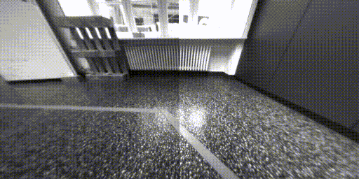
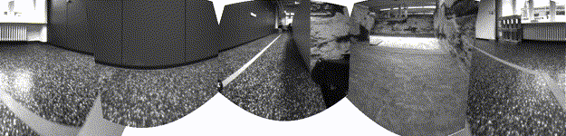
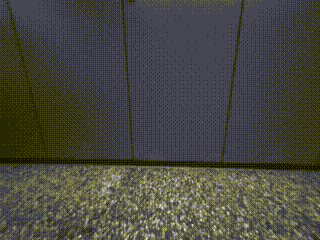
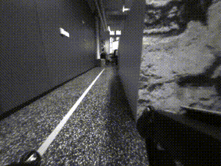

# image_projection
## Overview
image_projection is a [ROS](https://www.ros.org/) package to create various projections from multiple calibrated cameras. Use cases involve:

 - Rectify a distorted image
 - Create a cylindrical projection (equirectangular, mercator ..) from 360° camera data from multiple cameras
 - Create a perspective (pinhole) projection from fisheye camera data
 - Convert non-linear fisheye data to an ideal fisheye lense ("tru-theta")
 - Define a virtual pan-tilt camera

Available projection targets are:

 - Pinhole / perspective projection
 - Mercator projection
 - Ideal fisheye projection

Projections can be created periodically or on-demand. All projection parameters including image dimensions and position/direction can be configured dynamically at runtime. All cameras have to be calibrated beforehand.

A demo launch configuration is available below.

**Author/Maintainer: Martin Oehler<br/>
Affiliation:  [TU Darmstadt, SIM](https://www.sim.informatik.tu-darmstadt.de/index/)<br/>
License: MIT**

## Examples

**Insta 360 Air**
Low cost 360° camera with two fisheye lenses pointing in opposite directions
| Source Images | Pinhole projection | Mercator projection |
|--|--|--|
|  |  |  |

**Boston Dynamics Spot**
5 pinhole cameras, 2 at the front, 2 at the sides and 1 at the rear
| Source Images | | Pinhole projection | Mercator projection |
|--|--|--|--|
|  |   |  | |
|  |  | | |
|  | | | |

## Citation
Please cite our paper if you use this software as part of your scientific publication:

```
@INPROCEEDINGS{oehler2021flexible,
  author={Oehler, Martin and von Stryk, Oskar},
  booktitle={2021 European Conference on Mobile Robots (ECMR)}, 
  title={A Flexible Framework for Virtual Omnidirectional Vision to Improve Operator Situation Awareness}, 
  year={2021}
}
```

## Installation
If you haven't already installed it, [install ROS](http://wiki.ros.org/noetic/Installation/Ubuntu). Please use **Desktop-Full Install** to run the demo. Noetic is officially supported, but Melodic and Kinetic should work as well.

[Create a new catkin workspace](https://catkin-tools.readthedocs.io/en/latest/quick_start.html). Skip this step if you use your existing workspace. 
```
source /opt/ros/noetic/setup.bash
mkdir -p catkin_ws/src
cd catkin_ws/
catkin init
```

Go into the source directory of your workspace and check out image_projection
```
cd src/
git clone https://github.com/tu-darmstadt-ros-pkg/image_projection.git
```

Install dependencies via rosdep and wstool (.rosinstall)
```
cd image_projection
rosdep install --from-paths . --ignore-src -r -y
wstool init ../.. # not required if already initialized
wstool merge image_projection_https.rosinstall
wstool update
```
Build
```
catkin build image_projection_demo
```
and source the workspace
```
source ../../devel/setup.bash
```
Verify your installation by launching the demo (see below).

## Getting started

### Launching the demo
Make sure to open a new terminal after building the project for the first time.

Start by downloading the demo bag file with
```
roscd image_projection_demo/bags/
wget https://www.sim.informatik.tu-darmstadt.de/~oehler/insta360_air_robocup2018.bag
```
Launch the demo with
```
roslaunch image_projection_demo demo_insta360.launch
```
An [rqt](http://wiki.ros.org/rqt) window with the source video and projection examples will open. The [rqt_reconfigure](http://wiki.ros.org/rqt_reconfigure) GUI on the right side can be used to change projection parameters at runtime.

### Setting up your own projection
To use image_projection for your robot, you will need to update camera topics, calibration and projection parameters. You can duplicate the launch and configuration files in the demo and adapt them to your robot.

The main launch file is `image_projection_demo/launch/projections.launch`. It loads the configuration, calibration and starts up the projection nodelets.
Cameras are configured in `image_projection_demo/config/camera360_cameras.yaml`. This setup uses an extended camera calibration from kalibr.
Projections are configured in `image_projection_demo/config/projections.yaml`.

Lastly, make sure that your cameras are properly calibrated. For calibration instructions, refer to the section "Camera calibration" below.

### Camera calibration
The following calibration formats are supported:

- [sensor_msgs/CameraInfo] is the ROS standard camera calibration for pinhole cameras. It can be created with [camera_calibration]. Normally, the calibration file is loaded by the camera driver and published on `/[camera_name]/camera_info`.

- [kalibr_image_geometry_msgs/ExtendedCameraInfo] is an extended calibration format with additional support for fisheye cameras. The format is based on calibrations with [kalibr]. The extended calibration can be published with the node `kalibr_extended_camera_info_publisher/camera_info_publisher_node` on topic `/[camera_name]/extended_camera_info`. You can see an example in `image_projection_demo/launch/calibration_publisher.launch`. The node needs the calibration as a YAML file, you can see the format in `image_projection_demos/config/insta360_3_omni_radtan_calibration/camera360_right.yaml`. The information has to be filled in from the kalibr calibration file.

## Insights
### Method
image_projection projects multiple cameras onto 3D projection surfaces. The shapes of the projection surfaces are parameterized and depend on the chosen projection. A pinhole projection uses a planar projection surfaces, cylindrical projections, e.g. Mercator, use, as the name suggests, a cylindrical surface.
The surfaces are generated inside the scene with a pixel grid of the chosen target resolution. Each surface pixel is projected into every camera to retrieve color information. If the projected pixel is valid (inside the image) in more than one camera, the best match is chosen based on a heuristic. Pixels close to the respective image center are preferred.

Initially, a projection map is computed as described above. This step is rather costly and has to be repeated each time parameters are changed. The projection itself is comparatively cheap and implemented as a remap for each camera onto the same target image.

### Stitching Seams
Typically, projections with multiple camera sources show stitching seams. These seams are due to the fact, that camera centers to not coincide. With a wider baseline between the two cameras, more artifacts will be visible. Reversely, stitching quality improves if baselines are small. The effect can be mitigated by moving the projection surface to the typical distance of surrounding objects. Another common approach to eliminate stitching seams is blending, which might get integrated in the future. However, this can lead to ghosting artifacts.


## Nodes (Nodelets)
All nodes also come in nodelet variants (name in brackets) and are implemented as lazy subscribers.
### periodic_image_projection_node (image_projection/PeriodicImageProjectionNodelet)
This node/nodelet periodically publishes a projected image from the latest camera data. All projection parameters can be configured dynamically at runtime. No computation is performed, if the output topic is not subscribed.
#### Subscribed Topics

* **`/[camera_ns]/image_raw`** ([sensor_msgs/Image])

    The source camera images. `camera_ns` refers to the configured cameras (see `~cameras` parameter).
* **`/[camera_ns]/camera_info`** ([sensor_msgs/CameraInfo])

    Camera calibration. Make sure that only `camera_info` or `extended_camera_info` are published, never both.
* **`/[camera_topic]/extended_camera_info`** ([kalibr_image_geometry_msgs/ExtendedCameraInfo])

    Extended calibration info for calibration with kalibr. Make sure that only `camera_info` or `extended_camera_info` are published, never both.
* **`~set_pose`** ([geometry_msgs/Pose])

  Set the pose of the virtual sensor frame relative to `~base_frame`. Can be used to implement a virtual pan-tilt sensor head by updating the sensor pose based on joystick feedback.
* **`/tf`** and **`/tf_static`** ([tf2_msgs/TFMessage])

     [tf2](http://wiki.ros.org/tf2) is used to retrieve the transformations between each camera's optical frame and the projection `base_frame`.

#### Published Topics

* **`~projection`** ([sensor_msgs/Image])

    Projected image.
* **`~camera_info`** ([sensor_msgs/CameraInfo])

    In case of the `image_projection_plugins::PinholeProjection` plugin, the camera info of the projection is published on this topic if the parameters `virtual_sensor_frame` and `virtual_sensor_optical_frame` are set.

#### Services

* **`~project_pixel_to_ray`** ([image_projection_msgs/ProjectPixelTo3DRay])

    Can be called with the x/y-coordinates of a pixel in the projection and will return the corresponding 3D ray into the scene in `base_frame`.

#### Parameters

* **`~update_rate`** (double, default: 1.0)

    Publishing frequency of the projected image

* **`~base_frame`** (string, mandatory)

    Name of the tf frame in which the pose of the projection surface is defined.
* **`~virtual_sensor_frame`** (string, default: "")

    If set, this frame will be broadcasted to tf at the pose of the virtual sensor frame.
* **`~virtual_sensor_optical_frame`** (string, default: "")

    If set, this frame will be broadcasted to tf at the pose of the virtual sensor optical frame.
* **`~pose`** (list[double, default: [0, 0, 0, 0, 0, 0])

    Pose of the virtual sensor frame (also see `~virtual_sensor_frame`) relative to `~base_frame`. List with 6 entries in the order x, y, z, roll, pitch, yaw.
* **`~projection_type`** (string, mandatory)

    Name of a projection plugin (see below "Projection plugins")
* **`~projection_parameters/image_width`** (int, mandatory)

    Image width of the output projection.
* **`~projection_parameters/image_height`** (int, mandatory)

    Image height of the output projection.
* **`~projection_parameters`** (dict)

    Place parameters of the projection plugin in this namespace. For info on available parameters, see "Projection plugins" below.
* **`~always_recompute_mapping`** (bool, default: false)

    Forces a map update in each cycle instead of only when changes occurred. This can be used to achieve a uniform latency of the projection.
* **`~cameras`** (list[string], mandatory)

    List of camera namespaces to be used for projections. The camera namespace is the base namespace of your image and camera info topic; e,g, if your camera publishes the topics `/camera/image_raw` and `/camera/camera_info`, the camera namespace is `/camera`.
* **`[camera_ns]/image_topic`** (string, default: "image_raw")

    Configure the camera topic for each camera.
* **`[camera_ns]/camera_info_topic`** (string, default: "camera_info")

    Configure the camera info for each camera.
* **`[camera_ns]/extended_camera_info_topic`** (string, default: "extended_camera_info")

    Configure the extended camera info topic for each camera.


### image_projection_server_node
*Not yet implemented.* This node creates projections on-demand as a service.

## Projection plugins
Projections are implemented as [plugins](https://wiki.ros.org/pluginlib). The following plugins are available:
### image_projection_plugins::PinholeProjection
Creates a virtual perspective (pinhole) camera by creating a 3D plane. The camera points towards the x-axis in the camera frame and towards the z-axis in the optical frame (ROS standard).
#### Parameters
* **`~projection_parameters/focal_length`** (double, 1.0)

    Focal length of the simulated pinhole camera in meters.
* **`~projection_parameters/horizontal_fov`** (double, 90.0)

    Horizontal field of view in degree. Vertical field of view is calculated based on aspect ratio to enforce square pixels.
#### Published Topics
* **`~camera_info`** ([sensor_msgs/CameraInfo])

    Camera info of the generated pinhole projection.

### image_projection_plugins::MercatorProjection
The Mercator projection creates a virtual 3D cylinder projection surface.
#### Parameters
* **`~projection_parameters/cylinder_radius`** (double, 1.0)

    Radius of the cylinder in meters.
* **`~projection_parameters/vertical_fov`** (double, 1.0)

    Vertical field of view of the projection. This determines the height of the cylinder.
### image_projection_plugins::IdealFisheyeProjection
Generates an ideal ("tru-theta") fisheye image by creating a 3D sphere. An ideal fisheye image has a linear relationship between pixel distance from image center to corresponding light ray. Most real fisheye lenses do not achieve this.
#### Parameters
* **`~projection_parameters/sphere_radius`** (double, 1.0)

    Radius of the sphere in meters.
* **`~projection_parameters/fov`** (double, 1.0)

    Horizontal and vertical field of view of the fisheye in degree.
## Planned features

 - GPU support (OpenGL/CUDA)
 - Image blending

[sensor_msgs/Image]:https://docs.ros.org/en/melodic/api/sensor_msgs/html/msg/Image.html
[sensor_msgs/CameraInfo]: https://docs.ros.org/en/melodic/api/sensor_msgs/html/msg/CameraInfo.html
[kalibr_image_geometry_msgs/ExtendedCameraInfo]:https://github.com/tu-darmstadt-ros-pkg/kalibr_image_geometry/blob/master/kalibr_image_geometry_msgs/msg/ExtendedCameraInfo.msg
[geometry_msgs/Pose]:https://docs.ros.org/en/melodic/api/geometry_msgs/html/msg/Pose.html
[tf2_msgs/TFMessage]:https://docs.ros.org/en/melodic/api/tf2_msgs/html/msg/TFMessage.html
[camera_calibration]:http://wiki.ros.org/camera_calibration
[kalibr]:https://github.com/ethz-asl/kalibr
